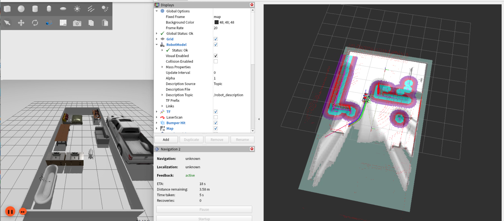
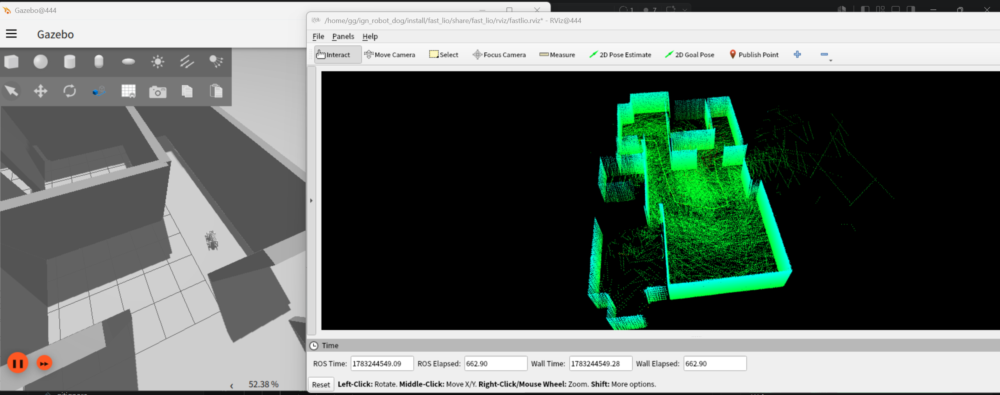

基于智元分支的仿真环境,使用苏研院定制 AGIBOT 上装,实现导航仿真
===

## 功能说明

当前导航仿真分为两种启动模式:

- `online` 建图模式: 启动 Gazebo/Ignition、机器人、Nav2、Cartographer, 用于在线建图。
- `local` 离线定位模式: 启动 Gazebo/Ignition、机器人、Nav2、`map_server`、AMCL, 加载 `map/local_map.yaml` 进行定位导航。

雷达数据链路:

```text
/scan/points -> /scan/points_to_scan -> /scan/filtered
```

- `/scan/points`: Ignition 输出的多线激光点云。
- `/scan/points_to_scan`: `pointcloud_to_laserscan` 转出的单线 `LaserScan`。
- `/scan/filtered`: `scan_box_filter` 过滤机器人本体遮挡后的 `LaserScan`, Nav2 costmap、Cartographer、AMCL 默认使用该话题。

## 使用方式

### 克隆本仓库

```bash
git clone --recursive https://github.com/opportunism-xiao/ign_robot_dog.git

### 安装依赖

```bash
sudo apt install -y \
  ros-humble-ros-gz \
  ros-humble-gz-ros2-control \
  ros-humble-ros2-control \
  ros-humble-ros2-controllers \
  ros-humble-navigation2 \
  ros-humble-nav2-bringup \
  ros-humble-cartographer-ros \
  ros-humble-robot-localization \
  ros-humble-rviz2 \
  ros-humble-tf2-ros \
  ros-humble-robot-state-publisher \
  ros-humble-xacro \
  ros-humble-joint-state-publisher \
  ros-humble-joint-state-publisher-gui \
  ros-humble-laser-filters \
  ros-humble-teleop-twist-keyboard \
  ros-humble-ros2launch
```

### 编译

```bash
colcon build --symlink-install
source install/setup.bash
```

### 离线定位导航

使用已有地图 `map/local_map.yaml`, 由 `nav2_local_map.launch.py` 启动 `map_server` 和 AMCL, 并加入 Nav2 lifecycle:

```bash
ros2 launch sim_ign_dog d1_gazebo_sim_dog_nav2_local.launch.py
```

### 在线建图导航

使用 Cartographer 在线建图, 同时启动 Nav2:

```bash
ros2 launch sim_ign_dog d1_gazebo_sim_dog_nav2_online.launch.py
```

建图完成后可保存地图:

```bash
ros2 launch local_map map_save.launch.py
```

> 考虑到稳定性启动的问题,按依赖启动耗时较长(预计 10s),请耐心等待;如启动失败请调节 urdf 中的激光雷达线束数量。

### 手动控制

控制节点不是必须的, 仅在需要手动控制机器狗时运行:

```bash
ros2 run teleop_twist_keyboard teleop_twist_keyboard
```



### 仅启动仿真环境

如果只使用仿真环境,不启动导航功能,可以运行:

```bash
ros2 launch sim_ign_dog d1_gazebo_sim_dog.launch.py 
```

### 启动3D建图功能

```bash
ros2 launch fast_lio mapping.launch.py
```



### 测试程序

练习节点,使用节点发布导航目标点,测试 Nav2 的导航功能:

```bash
source install/setup.bash
ros2 run pub_nav_goal pub_point --ros-args \
  -p goal_x:=7.0 \
  -p goal_y:=-1.0 \
  -p goal_yaw:=0.0
```

## 关键配置

- 离线地图: `map/local_map.yaml`
- 地图服务器参数: `src/slam/local_map/params/map_server.yaml`
- AMCL 参数: `src/nav2/sim_navigation2/params/amcl.yaml`
- 多线转单线参数: `src/slam/pointcloud_to_laserscan/params/pointcloud_to_laserscan.yaml`
- 过滤盒子参数: `src/slam/scan_box_filter/params/scan_box_filter.yaml`
- 局部代价地图: `src/nav2/sim_navigation2/params/local_costmap.yaml`
- 全局代价地图: `src/nav2/sim_navigation2/params/global_costmap.yaml`

过滤盒子可视化:

- RViz 添加 `Marker` 显示。
- Marker 话题选择 `/scan_box_filter/box_marker`。

## 参考仓库

- [anujjain-dev/unitree-go2-ros2](https://github.com/anujjain-dev/unitree-go2-ros2.git)

- [chvmp/champ](https://github.com/chvmp/champ.git)

## 开发参考

- 基坐标系 base_link
- 雷达坐标系 laser_up

- Ignition 单线雷达: `/scan`
- Ignition 多线雷达: `/scan/points`
- 多线转单线雷达: `/scan/points_to_scan`
- 盒子过滤器输出: `/scan/filtered`
- 过滤盒子 Marker: `/scan_box_filter/box_marker`

## 问题描述

> 当前在部分环境下,由于显卡与ign_gazebo的兼容性问题,会导致仿真环境无法正常启动,导致虚拟机崩溃

### 解决方案

参考 [ssh端口转发](https://github.com/chiway-luo/ssh-x11-forwarding-guide.git), 将仿真环境部署在远程服务器上,通过 ssh 连接进行仿真环境的使用。

## 二次开发建议

简化 urdf 的碰撞文件,可以极大减小控制器的加载时间,降低因为性能原因的启动失败问题。
